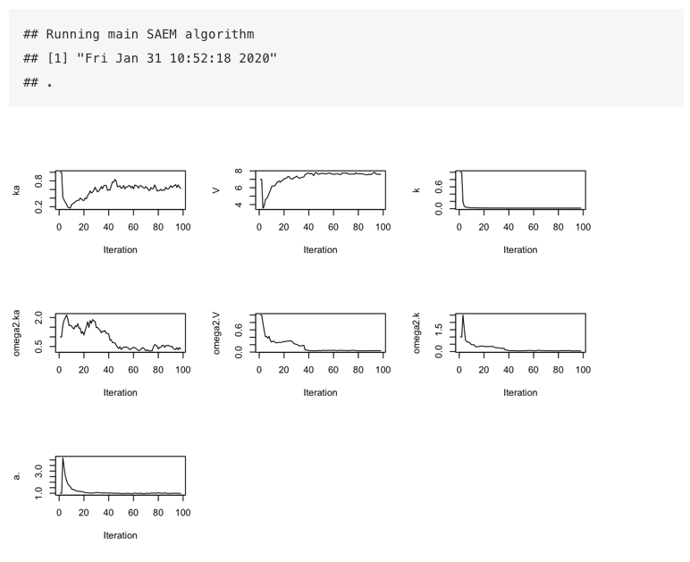
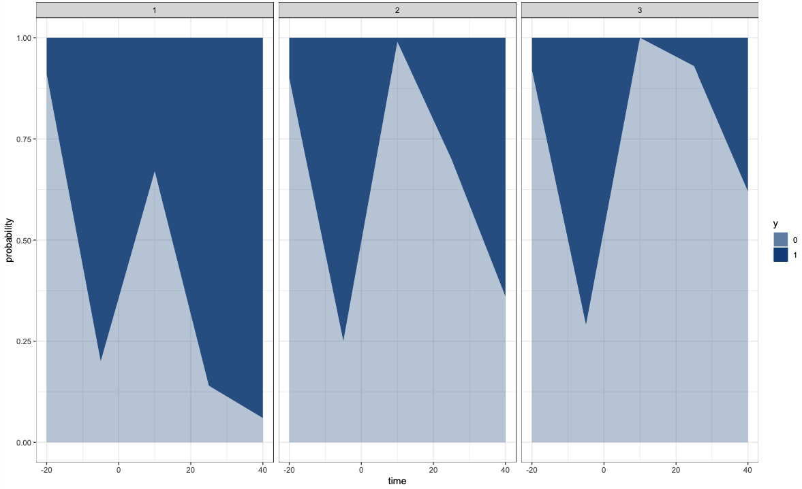
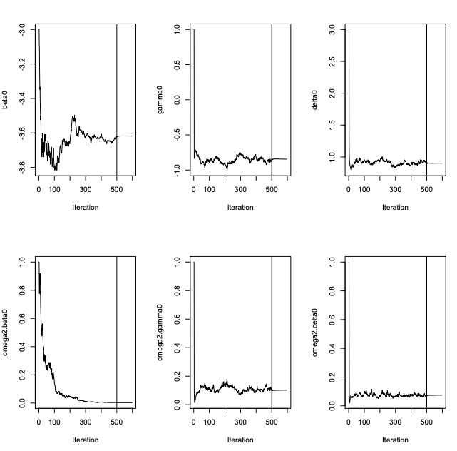

# Case Studies  {#casestudies}

Some basic Case Studies are demonstrated in this chapter; the vignettes will be discussing the application in more depth. 


<!-- saemix vignette -->

## A two-compartment PK model

```{r eval=FALSE,warning = FALSE, message = FALSE}
library(saemix)
?saemix
```


 **Read the Data**


```{r eval=FALSE,warning = FALSE, message = FALSE}
warfa_data <- read.table("data/warfarin_data.txt", header=T)
saemix.data<-saemixData(name.data=warfa_data,header=TRUE,sep=" ",
  na=NA, name.group=c("id"),name.predictors=c("amount","time"),
  name.response=c("y1"), name.X="time")
```
**Create the Model**

`saemix` models are contained in a R function with one blocks:

```{r eval=FALSE,warning = FALSE,message = FALSE}
model1cpt<-function(psi,id,xidep) {
  dose<-xidep[,1]
  tim<-xidep[,2]
  ka<-psi[id,1]
  V<-psi[id,2]
  k<-psi[id,3]
  CL<-k*V
  ypred<-dose*ka/(V*(ka-k))*(exp(-k*tim)-exp(-ka*tim))
  return(ypred)
}

saemix.model<-saemixModel(model=model1cpt,description="warfarin",
  type="structural",psi0=matrix(c(1,7,1,0,0,0),ncol=3,byrow=TRUE,
  dimnames=list(NULL, c("ka","V","k"))),transform.par=c(1,1,1),
  omega.init=matrix(c(1,0,0,0,1,0,0,0,1),ncol=3,byrow=TRUE),
  covariance.model=matrix(c(1,0,0,0,1,0,0,0,1),ncol=3,
  byrow=TRUE))

```

**Run the SAEM algorithm**

```{r eval=FALSE,warning = FALSE,message = FALSE}
K1 = 200
K2 = 100


#Run SAEM
options<-list(seed=39546,map=F,fim=F,ll.is=F,
  nbiter.mcmc = c(2,2,2), nbiter.saemix = c(K1,K2),nbiter.sa=0,
  displayProgress=TRUE,save.graphs=FALSE,nbiter.burn =0)
fit<-saemix(saemix.model,saemix.data,options)


```

```{r logo-figs, fig.cap='', out.width='100%', fig.asp=.75, fig.align='center', echo=FALSE}

```


## A categorical data model with regression variables

### mlxR: simulate synthetic data


```{r eval=FALSE,warning = FALSE,message = FALSE}
library("mlxR")
catModel <- inlineModel(
"[LONGITUDINAL]
input =  {beta0,gamma0,delta0, dose}
dose = {use=regressor}
EQUATION:
lm0 = beta0+gamma0*t + delta0*dose
D = exp(lm0)+1
p0 = exp(lm0)/D
p1 = 1/D

DEFINITION:
y = {type=categorical, categories={0, 1}, 
     P(y=0)=p0,
     P(y=1)=p1}
[INDIVIDUAL]
input={beta0_pop, o_beta0,
      gamma0_pop, o_gamma0,
      delta0_pop, o_delta0}
DEFINITION:
beta0  ={distribution=normal, prediction=beta0_pop,  sd=o_beta0}
gamma0  ={distribution=normal, prediction=gamma0_pop,  sd=o_gamma0}
delta0  ={distribution=normal, prediction=delta0_pop,  sd=o_delta0} ")

nobs = 15
tobs<- seq(-20, 50, by=nobs)
reg1 <- list(name='dose',
            time=tobs,
            value=10*(tobs>0))

reg2 <- list(name='dose',
            time=tobs,
            value=20*(tobs>0))

reg3 <- list(name='dose',
            time=tobs,
            value=30*(tobs>0))

out  <- list(name='y', time=tobs)
N  <- 100
p <- c(beta0_pop=-4, o_beta0=0.3, 
       gamma0_pop= -0.5, o_gamma0=0.2,
       delta0_pop=1, o_delta0=0.2)

g1 <- list(size=N,regressor = reg1)
g2 <- list(size=N,regressor = reg2)
g3 <- list(size=N,regressor = reg3)
g <- list(g1,g2,g3)
res <- simulx(model=catModel,output=out, group=g,parameter=p)
plot1 <- catplotmlx(res$y)
```

```{r  fig.cap='', out.width='100%', fig.asp=.75, fig.align='center', echo=FALSE}

```

### saemix: fit the noncontinuous data model
 
 **Create the saemix.data object**

```{r eval=FALSE,warning = FALSE, message = FALSE}
saemix.data<-saemixData(name.data=res,header=TRUE,sep=" ",
  na=NA, name.group=c("id"),name.predictors=c("amount","time"),
  name.response=c("y1"), name.X="time")
```
**Create the model**

`saemix` models are contained in a R function with one blocks:

```{r eval=FALSE,warning = FALSE,message = FALSE}
cat.model<-function(psi,id,xidep) {
level<-xidep[,1]
dose<-xidep[,2]
time<-xidep[,3]
th1 <- psi[id,1]
th2 <- psi[id,2]
delta0 <- psi[id,3]
lm0 <- th1+th2*time + delta0*dose
D <- exp(lm0)+1
P0 <- exp(lm0)/D
P1 <- 1/D

P.obs = (level==0)*P0+(level==1)*P1
return(P.obs) }

saemix.model<-saemixModel(model=cat.model,description="cat model",
  type="likelihood", psi0=matrix(c(2,1,2),ncol=3,byrow=TRUE,
  dimnames=list(NULL,c("th1","th2","th3"))),transform.par=c(0,0,0),
  covariance.model=matrix(c(1,0,0,0,1,0,0,0,1),ncol=3,byrow=TRUE),
  omega.init=matrix(c(2,0,0,0,1,0,0,0,1),ncol=3,byrow=TRUE),
  error.model="constant")

```

**Run the SAEM algorithm**

```{r eval=FALSE,warning = FALSE,message = FALSE}
K1 = 500
K2 = 100

options<-list(seed=39546,map=F,fim=F,ll.is=F,
  nbiter.mcmc = c(2,2,2), nbiter.saemix = c(K1,K2),nbiter.sa=0,
  displayProgress=TRUE,save.graphs=FALSE,nbiter.burn =0)
saemix.fit<-saemix(saemix.model,saemix.data,options)

```

```{r fig.cap='', out.width='100%', fig.asp=.75, fig.align='center', echo=FALSE}

```


## A repeated time-to-event data model


 **Read the Data**
```{r eval=FALSE,warning = FALSE, message = FALSE}
data(tte.saemix)
saemix.data<-saemixData(name.data=tte.saemix,header=TRUE,
  sep=" ",na=NA, name.group=c("id"),
  name.response=c("y"),name.predictors=c("time","y"),
  name.X=c("time"))
```
**Create the Model**

`saemix` models are contained in a R function with one blocks:

```{r eval=FALSE,warning = FALSE,message = FALSE}
timetoevent.model<-function(psi,id,xidep) {
	T<-xidep[,1]
	N <- nrow(psi)
	Nj <- length(T)
	censoringtime = 20
	lambda <- psi[id,1]
	beta <- psi[id,2]
	init <- which(T== 0)
	cens <- which(T== censoringtime)
	ind <- setdiff(1:Nj, append(init,cens))
	hazard <- (beta/lambda)*(T/lambda)^(beta-1)
	H <- (T/lambda)^beta
	logpdf <- rep(0,Nj)
	logpdf[cens] <- -H[cens] + H[cens-1]
	logpdf[ind] <- -H[ind] + H[ind-1] + log(hazard[ind])
	return(logpdf) }


saemix.model<-saemixModel(model=timetoevent.model,description="time model",
  type="likelihood", psi0=matrix(c(2,1),ncol=2,byrow=TRUE,
  dimnames=list(NULL, c("lambda","beta"))), transform.par=c(1,1),
  covariance.model=matrix(c(1,0,0,1),ncol=2, byrow=TRUE))

```

**Run the SAEM algorithm**

```{r eval=FALSE,warning = FALSE,message = FALSE}
K1 = 200
K2 = 100

saemix.options<-list(map=F,fim=F,ll.is=F, nb.chains = 1, 
  nbiter.saemix = c(K1,K2),displayProgress=TRUE,save.graphs=FALSE)
saemix.fit<-saemix(model,saemix.data,saemix.options)

```

```{r fig.cap='', out.width='100%', fig.asp=.75, fig.align='center', echo=FALSE}
knitr::include_graphics("figures/popparam_tte.png")
```
